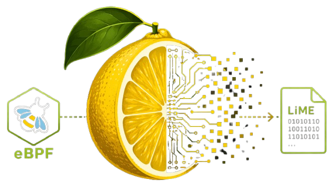

<table>
<thead>
  <tr>
    <th><h1 align=center>LEMON</h1></th>
  </tr>
</thead>
<tbody>
  <tr>
    <td><p align="center">

<p align="center">LEMON is a Linux and Android memory dump tool that utilizes eBPF to capture the entire physical memory of a system and save it in LiME format, compatible with forensic tools such as Volatility 3.</p>
</td>
  </tr>
</tbody>
</table>

 [](https://deepwiki.com/eurecom-s3/lemon)


LEMON is available as a precompiled static binary for x64 and ARM64, leveraging a CO-RE (Compile Once, Run Everywhere) eBPF program. This allows analysts to dump system memory without compiling anything on the target machine, checking for specific compatibility with installed libraries and kernel versions, and without requiring kernel headers. It is particularly useful in scenarios where loading kernel modules is not possible (e.g., due to Secure Boot) or when `{/proc, /dev}/kcore` is unavailable. If CO-RE is not available on the target machine a universal kernel-independent no CO-RE version of lemon can be run on it.

> [!warning]
> This tool is a research project and is not intended for production use.  The authors assume no responsibility for data loss, system instability, crashes, reboots, or any other unintended effects resulting from its use.
>
> On devices equipped with Exynos or MediaTek SoCs that enforce protections at EL2 (hypervisor level), this tool may trigger unexpected system reboots. While the issue has been resolved on Qualcomm-based devices, it remains unaddressed for Exynos and MediaTek platforms due to the lack of access to suitable test hardware. If you own one of these devices and are willing to assist with testing, please get in touch.

## Usage

Copy the `lemon` binary to the target machine and initiate a memory dump on disk with:

```sh
./lemon.MODE.ARCH -d memory_on_disk.dump
```

For a network dump instead use:

```sh
./lemon.MODE.ARCH -n TARGET_IP -p TARGET_PORT
```
while on the target machine
```sh
nc -l -p TARGET_PORT >  memory_by_net.dump
```

This generates a `memory.dump` file in LiME format, containing all physical memory pages. Since running eBPF programs typically requires root privileges, LEMON must be executed as `root` or with an appropriate `sudo` configuration.
Sometimes LEMON returns reading error on a 2MB block of pages: it is normal and due to KFENCE security infrastructure of the kernel.  

## Build

Precompiled static binaries are available in this repository (check the Github actions tab) or in the release section. Analysts can also compile LEMON themselves, either dynamically or statically. The dynamic version requires the presence of `libbpf`, `libz`, `libelf`, `libzstd` and `libcap` on the target machine, whereas the static version has no external dependencies. Note that the build machine **MUST** have the same CPU architecture as the target.

### Dependencies

To build LEMON, install the necessary dependencies on the analyst's machine. The following command sets up all required packages on an Ubuntu 24.04 system:

```sh
sudo apt install -y git make clang llvm libbpf-dev libcap-dev linux-tools-generic
```

Other distributions provide equivalent packages, which at minimum allow compiling the dynamic version via the system package manager.

### Build Procedure

1. **Clone the repository**

2. **Compile:**

   - Dynamic binary (MODE accepts: core, nocore (for using no CO-RE version based on kernel headers) and nocoreuni (for no CO-RE version using the universal header included in LEMON)):
     ```sh
     make MODE=core
     ```
   - Static binary:
     ```sh
     make MODE=core STATIC=1
     ```

## Limitations

- The kernel must support eBPF (obviously!).
- Kernel lockdown must not be in confidentiality mode (or must allow `bpf_probe_read_kernel()`).

## TODO

- [X] Support non CO-RE kernels
- [X] Insert checks on kernel versions and ```CONFIG_``` kernel options to extend support
- [X] Implement network dump (TCP)
- [X] Implement dump with reduced granule if page fail to be read
- [X] Introduce support for kernels that do not have uprobes
- [ ] Support for Exynos SoCs
- [ ] Support for Mediatek SoCs
- [ ] Support other CPU architectures (x32, ARM32, MIPS, PowerPC, POWER, RISC-V)
- [ ] Use of `_stext` in x64 to bypass missing `CONFIG_KALLSYMS_ALL`
- [ ] Bruteforce scanning (?) for page containing same data of  `_stext` page in ARM64 to bypass missing `CONFIG_KALLSYMS_ALL`

## Notes

### eBPF cronology
- Introduction of eBPF: 3.15
- Introduction of Array maps 3.19
- Introduction of kProbe/uProbe support 4.1
- Introduction of tracepoint support (syscalls tracing) 4.7
- Introduction of XDP 4.8
- Android 9 support eBPF: 4.9
- Introduction of BTF 4.18
- Introduction mmap() support for array maps 5.5
- !!! Introduction of read_kernel() 5.5 <==== Minimum Lemon target version
- Introduction of ring_buffer 5.8
- Android 13 support BTF 5.15
- Introduction of SYSCALL program type 5.15
- Introduction of kallsyms() in ebpf 5.16

### Related Projects

The following additional tools can be used to enable memory analysis of Linux and Android devices:

- [btf2json](https://github.com/eurecom-s3/lemon-btf2json)  
  Converts Linux BTF debug information into JSON profiles compatible with Volatility 3.

- [volatility3-arm64](https://github.com/eurecom-s3/volatility3-arm64)  
  Extended version of Volatility 3 with support for ARM64 memory analysis.

These components are used together with LEMON to generate and analyze memory dumps on modern Android and Linux systems